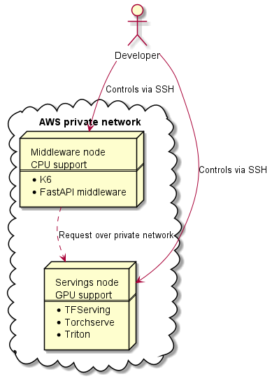

# Set up test instances in AWS

This document will guide you through deploying the project on your own servers in AWS.



## Prerequisites

1. Install [awscli](https://docs.aws.amazon.com/cli/latest/userguide/install-cliv2.html) on your local computer
2. [Configure awscli](https://docs.aws.amazon.com/cli/latest/userguide/cli-chap-configure.html) to connect to your AWS account

:point_right: We are running all experiments in the eu-west-1 region and zone A.

## Security prerequisites for EC2 instances

First, you need to import your public key into the AWS account so that you can connect to the instances later using SSH.

```bash
aws ec2 import-key-pair --key-name "key-servings-test" --public-key-material fileb://~/.ssh/id_rsa.pub
```

Next, we create two security groups. One for the GPU instance and one for the CPU instance where the middleware and load testing tool will run.

```bash
MY_IP=$(curl -sS https://checkip.amazonaws.com/)

{
    aws ec2 create-security-group --group-name "security-group-t-middleware" --description "Security group for middleware CPU instance"
    aws ec2 create-security-group --group-name "security-group-t-servings" --description "Security group for servings GPU instance"
    
    aws ec2 authorize-security-group-ingress --group-name security-group-t-middleware --protocol tcp --port 22 --cidr "${MY_IP}"/32
    aws ec2 authorize-security-group-ingress --group-name security-group-t-servings --protocol tcp --port 22 --cidr "${MY_IP}"/32
    
    # Torchserve HTTP and GRPC:
    aws ec2 authorize-security-group-ingress --group-name security-group-t-servings --protocol tcp --port 8080 --source-group security-group-t-middleware
    aws ec2 authorize-security-group-ingress --group-name security-group-t-servings --protocol tcp --port 7070 --source-group security-group-t-middleware
    
    # TFserving HTTP and GRPC:
    aws ec2 authorize-security-group-ingress --group-name security-group-t-servings --protocol tcp --port 8501 --source-group security-group-t-middleware
    aws ec2 authorize-security-group-ingress --group-name security-group-t-servings --protocol tcp --port 9000 --source-group security-group-t-middleware
    
    # Triton HTTP and GRPC:
    aws ec2 authorize-security-group-ingress --group-name security-group-t-servings --protocol tcp --port 8000 --source-group security-group-t-middleware
    aws ec2 authorize-security-group-ingress --group-name security-group-t-servings --protocol tcp --port 8001 --source-group security-group-t-middleware
}
```

## EC2 instances

### Create instances

Let's create two instances:

1. GPU with servings
2. CPU with middleware and K6 for load testing

(This may take some time.)

We will use two different AMIs. For the GPU instance we will use the latest (July 2021) [Deep learning AMI from AWS](https://aws.amazon.com/machine-learning/amis/) and for the CPU instance we will use the [LTS version of Ubuntu from Canonical](https://aws.amazon.com/marketplace/pp/prodview-iftkyuwv2sjxi).

```bash
aws ec2 describe-images \
        --region eu-west-1 \
        --owners amazon \
        --filters "Name=name,Values=Deep Learning AMI (Ubuntu 18.04) Version *" "Name=state,Values=available" \
        --query "reverse(sort_by(Images, &Name))[:1].ImageId" \
        --output text
        
        
aws ec2 describe-images \
        --region eu-west-1 \
        --owners 099720109477 \
        --filters "Name=name,Values=ubuntu/images/hvm-ssd/ubuntu-focal-20.04-amd64-server-*" "Name=state,Values=available" \
        --query "reverse(sort_by(Images, &Name))[:1].ImageId" \
        --output text
```

```bash
{
    # This instance is for servings
    aws ec2 run-instances \
        --image-id ami-081764442f732173f \
        --instance-type g4dn.xlarge \
        --count 1 \
        --tag-specifications 'ResourceType=instance,Tags=[{Key=Name,Value=Servings-Experiment}]' \
        --security-groups security-group-t-servings \
        --placement AvailabilityZone=eu-west-1a \
        --enable-api-termination \
        --ebs-optimized \
        --block-device-mapping "[ { \"DeviceName\": \"/dev/sda1\", \"Ebs\": { \"VolumeSize\": 256 } } ]" \
        --key-name key-servings-test \
        --no-cli-pager
        
    # This instance is for middleware
    aws ec2 run-instances \
        --image-id ami-03caf24deed650e2c \
        --instance-type c5.xlarge \
        --count 1 \
        --tag-specifications 'ResourceType=instance,Tags=[{Key=Name,Value=Middleware-Experiment}]' \
        --security-groups security-group-t-middleware \
        --placement AvailabilityZone=eu-west-1a \
        --enable-api-termination \
        --ebs-optimized \
        --block-device-mapping "[ { \"DeviceName\": \"/dev/sda1\", \"Ebs\": { \"VolumeSize\": 128 } } ]" \
        --key-name key-servings-test \
        --no-cli-pager
}
```

### Setup

Now we need to install the necessary software on each instance.

#### First instance: Servings (the one with the GPU) 

```bash
IP_ADDRESS_SERVINGS=$(aws ec2 describe-instances \
        --filters "Name=instance-state-name,Values=running" "Name=tag:Name,Values=Servings-Experiment" \
        --query 'Reservations[*].Instances[*].[PublicIpAddress]' \
        --output text)

echo "servings IP: $IP_ADDRESS_SERVINGS"
```

If IP is empty, wait some time. Otherwise you can continue with:

```bash
ssh ubuntu@${IP_ADDRESS_SERVINGS}
```

Install Docker Compose:

```bash
{
    sudo curl -L "https://github.com/docker/compose/releases/download/1.29.2/docker-compose-$(uname -s)-$(uname -m)" -o /usr/local/bin/docker-compose
    sudo chmod +x /usr/local/bin/docker-compose
}
```

#### Second instance: Middleware (the one with the CPU) 

```bash
IP_ADDRESS_MIDDLEWARE=$(aws ec2 describe-instances \
        --filters "Name=instance-state-name,Values=running" "Name=tag:Name,Values=Middleware-Experiment" \
        --query 'Reservations[*].Instances[*].[PublicIpAddress]' \
        --output text)
        
echo "middleware IP: $IP_ADDRESS_MIDDLEWARE"
```

If IP is empty, wait some time. Otherwise you can continue with:

```bash
ssh ubuntu@${IP_ADDRESS_MIDDLEWARE}
```

Install Docker:

```bash
{
    bash <(curl -fsSL https://get.docker.com)
    sudo usermod -aG docker ubuntu
    newgrp docker
}
```

Install Docker Compose:

```bash
{
    sudo curl -L "https://github.com/docker/compose/releases/download/1.29.2/docker-compose-$(uname -s)-$(uname -m)" -o /usr/local/bin/docker-compose
    sudo chmod +x /usr/local/bin/docker-compose
}
```

Install K6:

```bash
{

    sudo apt-key adv --keyserver hkp://keyserver.ubuntu.com:80 --recv-keys C5AD17C747E3415A3642D57D77C6C491D6AC1D69
    echo "deb https://dl.k6.io/deb stable main" | sudo tee /etc/apt/sources.list.d/k6.list
    sudo apt update
    sudo apt -y install k6
}
```

## Perform the test

#### Servings instance

```bash
git clone --depth 1 https://github.com/Biano-AI/serving-compare-middleware.git
cd serving-compare-middleware/

docker-compose -f docker-compose.test.yml up tfserving

# and then after testing:
docker-compose -f docker-compose.test.yml up torchserve

# and finally:
docker-compose -f docker-compose.test.yml up triton
```

#### Middleware instance

```bash
ssh ubuntu@${IP_ADDRESS_MIDDLEWARE}
```
Clone middleware repository:

```bash
git clone --depth 1 https://github.com/Biano-AI/serving-compare-middleware.git
```

We need to configure servings now. 

From your local machine run:
```bash
PRIVATE_DNS_SERVINGS=$(aws ec2 describe-instances \
        --filters "Name=instance-state-name,Values=running" "Name=tag:Name,Values=Servings-Experiment" \
        --query 'Reservations[*].Instances[*].[PrivateDnsName]' \
        --output text)
```

```bash
echo ${PRIVATE_DNS_SERVINGS}
```
This value is **private** DNS address of the serving instance and it should look something like this: `ip-192-168-xx-xx.eu-west-1.compute.internal`.
Next step is to create env variables for middleware.
```bash
cat <<EOF | ssh ubuntu@${IP_ADDRESS_MIDDLEWARE} 'cat > ~/serving-compare-middleware/.env' 
TFSERVING_SERVICE_URL=http://${PRIVATE_DNS_SERVINGS}:8501/v1/models/resnet_50_classification:predict  
TORCHSERVE_SERVICE_URL=http://${PRIVATE_DNS_SERVINGS}:8080/predictions/resnet-50  
TRITON_SERVICE_HOST=${PRIVATE_DNS_SERVINGS}:8000
EOF
```

Than you can run middleware API on the middleware machine:
```bash
docker-compose --file docker-compose.test.yml up --detach --build web
```

Now you can run K6 for load testing. Between each test, you must stop the running serving (<kbd>CTRL</kbd>+<kbd>C</kbd>) on the GPU instance and start the next one.

```bash
k6 run --vus 10 --duration 20s \
        -e MIDDLEWARE_HOST=localhost:8000 \
        -e SERVING_TYPE=tfserving \
        script.js

k6 run --vus 10 --duration 20s \
        -e MIDDLEWARE_HOST=localhost:8000 \
        -e SERVING_TYPE=torchserve \
        script.js
        
k6 run --vus 10 --duration 20s \
        -e MIDDLEWARE_HOST=localhost:8000 \
        -e SERVING_TYPE=triton_tensorflow \
        script.js
        
k6 run --vus 10 --duration 20s \
        -e MIDDLEWARE_HOST=localhost:8000 \
        -e SERVING_TYPE=triton_pytorch \
        script.js
```

## Cleanup

```bash
{
    aws ec2 delete-security-group --group-name security-group-t-servings
    aws ec2 delete-security-group --group-name security-group-t-middleware
}


ID_SERVINGS=$(aws ec2 describe-instances \
        --filters "Name=instance-state-name,Values=running" "Name=tag:Name,Values=Servings-Experiment" \
        --query 'Reservations[*].Instances[*].[InstanceId]' \
        --output text)


ID_MIDDLEWARE=$(aws ec2 describe-instances \
        --filters "Name=instance-state-name,Values=running" "Name=tag:Name,Values=Middleware-Experiment" \
        --query 'Reservations[*].Instances[*].[InstanceId]' \
        --output text)
        
aws ec2 terminate-instances --instance-ids ${ID_SERVINGS}
aws ec2 terminate-instances --instance-ids ${ID_MIDDLEWARE}

aws ec2 delete-key-pair --key-name key-servings-test
```

